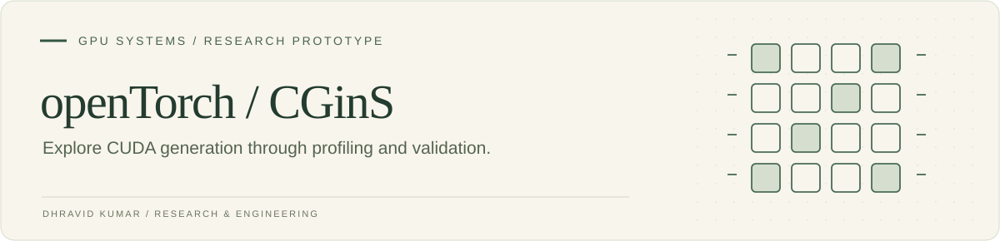

**CGinS — CUDA Ghost in the Shell** explores how language models can translate PyTorch operations into CUDA kernels using runtime context and correctness feedback. This repository brings together the research implementation, generated-kernel workspace, and a Jac interface.

[Implementation](CGinS-gui/) · [Research paper](CGinS-gui/CGinS-Paper.pdf) · [Original documentation](CGinS-gui/README.md) · [Jac interface guide](CGinS-gui/README_JAC.md)

## The engineering loop


The interesting boundary is between generated code and executable evidence: tensor inputs, compilation results, and comparison with the reference operation all participate in the feedback loop.

## Navigate the implementation

| Location | Purpose |
| :--- | :--- |
| [CGinS-gui/src](CGinS-gui/src/) | Generation and optimization implementation |
| [CGinS-gui/benchmarks](CGinS-gui/benchmarks/) | Profiling and benchmark workspace |
| [CGinS-gui/kernels](CGinS-gui/kernels/) | CUDA kernel workspace |
| [CGinS-gui/cgins_runtime](CGinS-gui/cgins_runtime/) | Runtime integration |
| [CGinS-gui/main.jac](CGinS-gui/main.jac) | Jac application entry point |
| [CGinS-gui/cgins-frontend](CGinS-gui/cgins-frontend/) | Frontend implementation |

## Getting oriented

```bash
git clone https://github.com/Dhravidk/openTorch.git
cd openTorch/CGinS-gui
```

Start with the [implementation README](CGinS-gui/README.md) and [Jac guide](CGinS-gui/README_JAC.md) for environment and provider setup. GPU execution requires a compatible NVIDIA/CUDA environment; generation uses a configured model provider.

## Research context

This is an exploratory research implementation. Consult the included paper for its experimental setting and reported results. Performance depends on the operator, workload, hardware, and baseline; the presence of a generated kernel does not establish an application-level speedup.

The original implementation and its documentation remain under `CGinS-gui/`.
